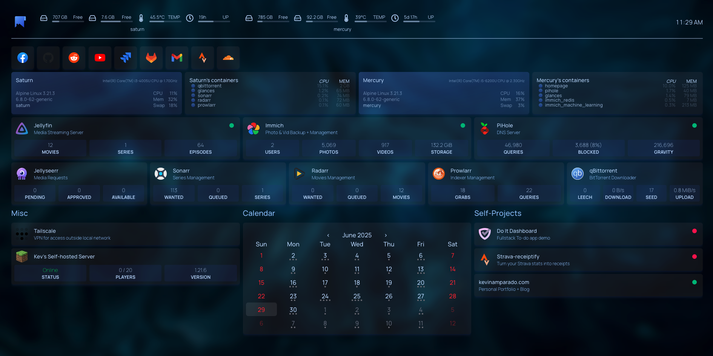

# Homelab

Where I can build stuff and break stuff.

Unlike in a work setting, Infrastructure is made to become stable and safe.

As a DevOps engineer, I can freely test out things that I'm curious about in this environment. With less risks and consequences compared to the former

## Homepage setup

